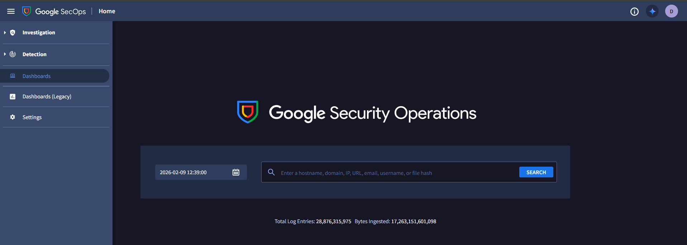
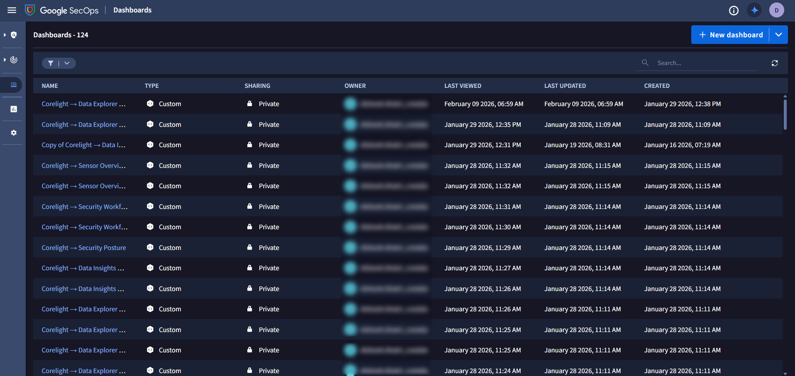
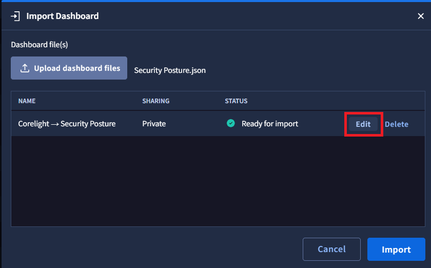
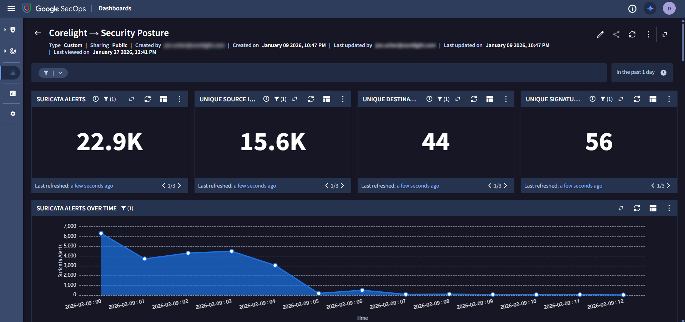

# Google SecOps Dashboards for Corelight

## Overview

This guide provides step-by-step instructions for setting up and utilizing **Google SecOps Dashboards** to monitor and analyze network traffic data. By leveraging the capabilities of Chronicle Backstory, these dashboards deliver scalable, real-time insights across your organization's infrastructure, enhancing your security operations and visibility.

## Pre-requisites

Before you begin, ensure the following prerequisites are met:

- **Google SecOps Platform Access:** You must have an active account with access to the Google SecOps platform.
- **Google SecOps Dashboards Access:** Ensure you have the necessary permissions to access and create custom dashboards in the dashboards section.
- **GitHub Repository Access:** Ensure you have access to the [CorelightForSecOps](https://github.com/corelight/CorelightForSecOps/tree/main) GitHub repository, which includes the necessary dashboard configuration files. Also, verify that the required parsers are enabled and logs are sent to Google Security Operations using Corelight Sensor which is stated [here](https://github.com/corelight/CorelightForSecOps/blob/main/README.md).

## Installation & Configuration

### Create a reference list (For identifying Internal/External IPs)

1. Head over to the **Google SecOps** Platform

2. From the left side menu go to **Detections -> Lists** Section

3. Now a List manager popup will appear. Click on **Create** button for creating a new List.

4. In the popup, select the **Syntax type** of the list as **CIDR** and name the title of the list as **internal_cidr_list**. Also, add the **IP CIDR range** (as per your requirement) in the last section.

5. Finally, Click on **Save Edits** from the bottom right corner and your CIDR list will be created.

### Deploy Dashboards from GitHub Repository

To set up the SecOps Dashboards, you'll need to deploy them from the [CorelightForSecOps](https://github.com/corelight/CorelightForSecOps/tree/main) GitHub repository. Follow these steps to do so:

### Step 1: Download Dashboard Configuration Files from GitHub

- Navigate to the [CorelightForSecOps](https://github.com/corelight/CorelightForSecOps/tree/main) GitHub repository and head over to the [dashboards](https://github.com/corelight/CorelightForSecOps/tree/develop/dashboards) folder.
- Download the JSON configuration files for the dashboards to your local machine.

### Step 2: Open Google SecOps and Navigate to Dashboards

- Launch the Google SecOps platform in your preferred browser.
- Navigate to the Dashboards section in the interface.
- In the Dashboards section, you will see a list of custom dashboards.

### Step 3: Import the downloaded dashboards

- In the top-right corner, click the downward arrow next to the New Dashboard button.
- Select Import from JSON from the dropdown menu.

### Step 4: Upload the Desired Dashboard JSON File

- A dialog will prompt you to upload a file. Click on **Upload dashboard files**.
- Browse your local system and select the desired JSON file from the downloaded configurations.
- Click **Import** to complete the upload.

### Step 5: Rename the Imported Dashboard (Optional)

- When importing a dashboard from your local machine, after selecting the file in the pop-up window, click the **Edit** button next to the selected dashboard file and rename it according to your preference and click on **Save** button.
- Also, you can change the access of your dashboard to public or private based on your preferences.
- Lastly, click on **Import** after editing the name.

### Step 6: Access and View Your Imported Dashboard

- Use the search bar to locate the newly imported dashboard by name.
- Click on the dashboard to view its contents, including charts, graphs, and real-time data visualizations.

After clicking on the dashboard you imported, you will be able to view your dashboard based on your instance data.
